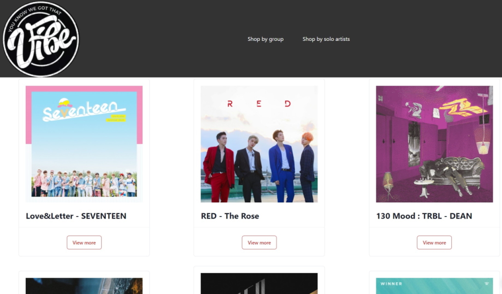
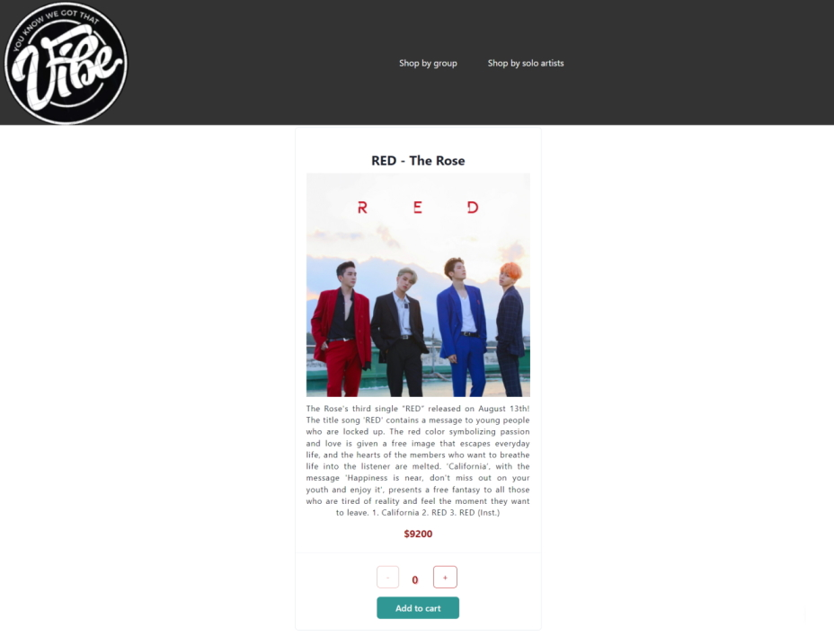
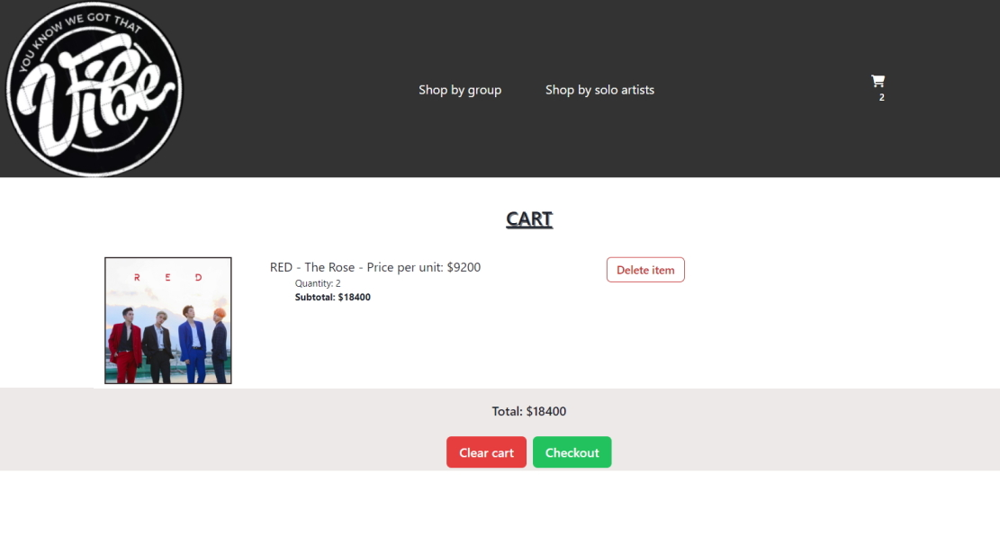
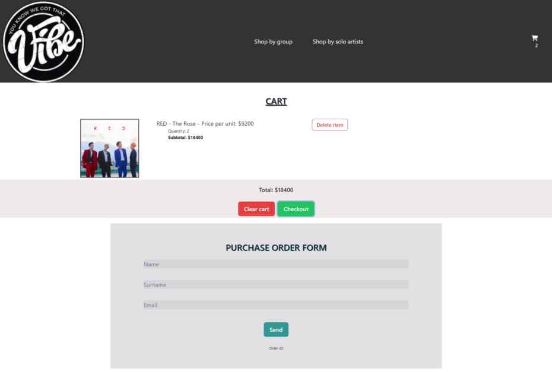

# My First React Project | Ecommerce = Vibe | SPA
Esta es la entrega final del curso de React Js en Coderhouse. 
Es una single-page application de una tienda de álbumes de artistas de K-Pop.

## Para inicializar el proyecto
- npm i
- npm run dev

## Librería utilizada
- Chakra UI

# Vistas
- Home

- Detalle de producto

- Carrito

- Formulario de compra

## Navegabilidad del sitio (gif)

